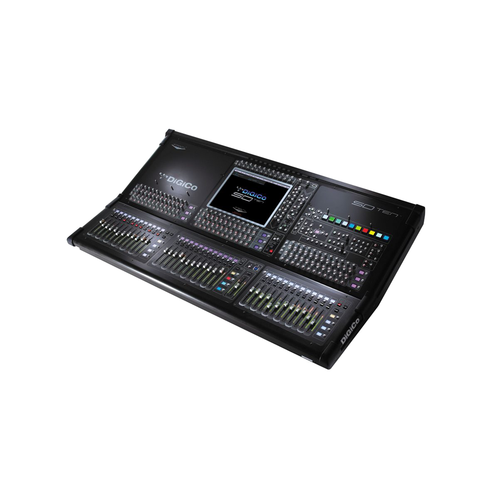

# 📋 Used Equipment Management Guide

## 🚀 **Super Easy Way to Add/Remove Equipment**

### ➕ **To ADD New Equipment:**

1. **Copy the template** from the HTML comment in `index.html` (lines 175-200)
2. **Paste it** after the last equipment item
3. **Replace the placeholders:**
   - `YOUR_IMAGE.jpg` → Your image filename
   - `YOUR EQUIPMENT NAME` → Equipment name
   - `Brief Description` → Short description
   - `Feature 1, 2, 3, 4` → Equipment features
   - `$YOUR_PRICE` → Price
4. **Add your image** to `images/equipment/` folder
5. **Save and refresh** your website

### ➖ **To REMOVE Equipment:**

1. **Find the equipment block** you want to remove
2. **Delete the entire `<div class="used-equipment-item">...</div>` block**
3. **Save and refresh** your website

### 📝 **Example: Adding a New Mixer**

```html
<div class="used-equipment-item">
    
    <div class="equipment-details">
        <h3>DiGiCo SD10 with SD-Rack and Fiber</h3>
        <p class="equipment-description">Professional Digital Mixing Console</p>
        <ul class="equipment-features">
            <li><i class="fas fa-plug"></i> 144 Input Channels</li>
            <li><i class="fas fa-sliders"></i> 64 Aux / Sub-Group Busses</li>
            <li><i class="fas fa-microchip"></i> HMA Fiber Option</li>
            <li><i class="fas fa-desktop"></i> Waves option card</li>
        </ul>
        <div class="equipment-meta">
            <div class="condition">
                <i class="fas fa-star">Used in Perfect Condition</i>
                <i class="fas fa-star">HMA Fiber 220' included</i>
                <i class="fas fa-star">SD-Rack 56 x 24</i>
                <i class="fas fa-star"></i>
                <i class="fas fa-star"></i>
                <span>5.0/5.0</span>
            </div>
            <div class="price">$36,000</div>
        </div>
        <p class="sale-note">* Sold as is. Details to be confirmed.</p>
        <a href="#contact" class="btn btn-primary">Inquire Now</a>
    </div>
</div>
```

### 🎨 **Icon Options for Features:**

- `fas fa-plug` - Inputs/Outputs
- `fas fa-sliders` - Channels/Faders
- `fas fa-microchip` - Processing/DSP
- `fas fa-desktop` - Screens/Interface
- `fas fa-volume-up` - Audio/Sound
- `fas fa-network-wired` - Networking
- `fas fa-cog` - Settings/Controls
- `fas fa-wave-square` - Frequency/Signal

### ⭐ **Star Rating Guide:**

- **5 stars:** `<i class="fas fa-star"></i>` (5 times)
- **4 stars:** 4x `fas fa-star` + 1x `far fa-star`
- **3 stars:** 3x `fas fa-star` + 2x `far fa-star`
- **2 stars:** 2x `fas fa-star` + 3x `far fa-star`
- **1 star:** 1x `fas fa-star` + 4x `far fa-star`

### 📁 **File Organization:**

```
images/equipment/
├── profile.jpg (current)
├── your-new-equipment1.jpg
├── your-new-equipment2.jpg
└── ...
```

### 🔧 **Quick Tips:**

- **Image size:** 400x300 pixels works best
- **File format:** JPG or PNG
- **Keep filenames simple:** no spaces, use dashes
- **Test after changes:** Always refresh to see updates

---

**Need help?** The template is right in your HTML file - just copy, paste, and customize! 🎵